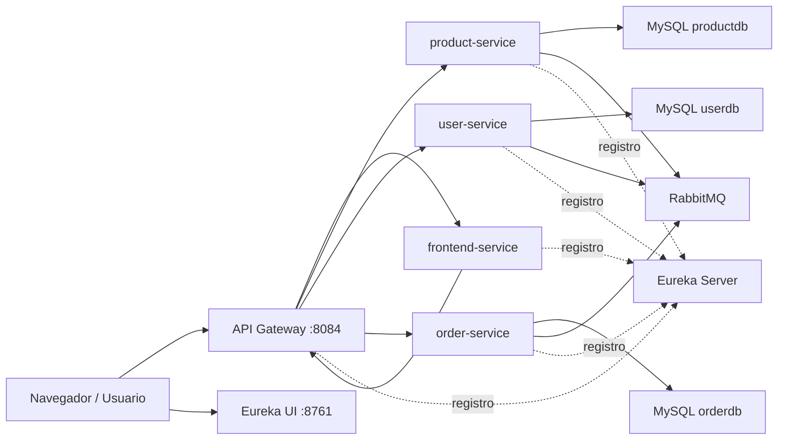

# OLX Certus Servicios

Marketplace tipo OLX implementado con arquitectura de microservicios usando Spring Boot, Eureka Server, API Gateway, Docker Compose, MySQL y RabbitMQ.

El sistema permite registrar usuarios, iniciar sesion, publicar productos, listar categorias, crear solicitudes de compra y revisar la documentacion Swagger de cada API desde un unico punto de entrada.

## Stack Tecnico

| Tecnologia | Uso |
| --- | --- |
| Java 21 | Lenguaje principal |
| Spring Boot 4.0.5 | Framework base de los servicios |
| Spring Cloud 2025.1.1 | Eureka, Gateway y balanceo |
| Spring Cloud Netflix Eureka | Registro y descubrimiento de servicios |
| Spring Cloud Gateway MVC | API Gateway |
| Springdoc OpenAPI | Swagger UI y especificaciones OpenAPI |
| Thymeleaf | Frontend server-side |
| MySQL 8 | Persistencia por dominio |
| RabbitMQ | Mensajeria entre servicios |
| Docker Compose | Orquestacion local |
| Maven Wrapper | Build reproducible por servicio |

## Arquitectura

El proyecto sigue una arquitectura de microservicios. Cada servicio mantiene su responsabilidad funcional y se registra en Eureka. El API Gateway es el punto de entrada principal para el frontend, las APIs REST y Swagger.



## Servicios

| Servicio | Puerto host | Puerto interno | Responsabilidad |
| --- | ---: | ---: | --- |
| eureka-server | 8761 | 8761 | Registro y descubrimiento |
| api-gateway | 8084 | 8084 | Entrada unica HTTP, Swagger centralizado y ruteo |
| frontend-service | 8082 | 8080 | Interfaz web Thymeleaf |
| product-service | 8080 | 8080 | Productos, categorias, imagenes, atributos y ubicaciones |
| user-service | 8081 | 8080 | Usuarios, registro y login |
| order-service | 8083 | 8080 | Solicitudes de compra, mensajes y estados |
| mysql-product | 3307 | 3306 | Base de datos de productos |
| mysql-user | 3308 | 3306 | Base de datos de usuarios |
| mysql-order | 3309 | 3306 | Base de datos de ordenes |
| rabbitmq | 5672 / 15672 | 5672 / 15672 | Broker AMQP y consola web |

## Flujo Principal

1. El usuario entra por `http://localhost:8084`.
2. El API Gateway enruta las pantallas al `frontend-service`.
3. El frontend consume las APIs por medio del gateway usando `http://api-gateway/api`.
4. El gateway resuelve los servicios mediante Eureka con rutas `lb://`.
5. Cada microservicio atiende su dominio y persiste en su base MySQL.
6. Swagger centralizado permite probar cada API desde el gateway.

## Eureka

Eureka esta disponible en:

```text
http://localhost:8761
```

Servicios esperados registrados:

| Aplicacion en Eureka | Servicio |
| --- | --- |
| API-GATEWAY | api-gateway |
| FRONTEND-SERVICE | frontend-service |
| PRODUCT-SERVICE | product-service |
| USER-SERVICE | user-service |
| ORDER-SERVICE | order-service |

Cada servicio usa:

```properties
eureka.client.serviceUrl.defaultZone=http://eureka-server:8761/eureka/
eureka.instance.prefer-ip-address=true
```

## API Gateway

Gateway principal:

```text
http://localhost:8084
```

El gateway usa rutas con balanceo por Eureka (`lb://service-name`) y mantiene los puertos directos para no romper el flujo anterior.

| Ruta Gateway | Destino |
| --- | --- |
| `/` | frontend-service |
| `/login` | frontend-service |
| `/register` | frontend-service |
| `/logout` | frontend-service |
| `/products/**` | frontend-service |
| `/categories/**` | frontend-service |
| `/orders/**` | frontend-service |
| `/api/products/**` | product-service |
| `/api/categories/**` | product-service |
| `/api/product-images/**` | product-service |
| `/api/product-attributes/**` | product-service |
| `/api/product-locations/**` | product-service |
| `/api/users/**` | user-service |
| `/api/orders/**` | order-service |
| `/docs/product-service/api-docs` | OpenAPI product-service |
| `/docs/user-service/api-docs` | OpenAPI user-service |
| `/docs/order-service/api-docs` | OpenAPI order-service |

## Swagger y OpenAPI

Swagger centralizado del gateway:

```text
http://localhost:8084/swagger-ui.html
http://localhost:8084/swagger-ui/index.html
```

En el selector superior se puede cambiar entre:

```text
product-service
user-service
order-service
```

OpenAPI por microservicio a traves del gateway:

```text
http://localhost:8084/docs/product-service/api-docs
http://localhost:8084/docs/user-service/api-docs
http://localhost:8084/docs/order-service/api-docs
```

Swagger directo por servicio:

```text
http://localhost:8080/swagger-ui.html  product-service
http://localhost:8081/swagger-ui.html  user-service
http://localhost:8083/swagger-ui.html  order-service
http://localhost:8084/swagger-ui.html  api-gateway
```

Nota importante: los OpenAPI de los microservicios fueron ajustados para usar `/api` como servidor base. Asi, cuando se prueba desde Swagger del gateway, los endpoints se ejecutan contra:

```text
http://localhost:8084/api/...
```

## Frontend

Entrada recomendada:

```text
http://localhost:8084
```

Entrada directa conservada:

```text
http://localhost:8082
```

Rutas principales:

| Ruta | Descripcion |
| --- | --- |
| `/` | Home y listado de productos |
| `/register` | Registro de usuarios |
| `/login` | Inicio de sesion |
| `/logout` | Cierre de sesion |
| `/products/new` | Formulario para publicar producto |
| `/products/{id}` | Detalle de producto |
| `/categories` | Listado de categorias |
| `/categories/new` | Crear categoria |
| `/orders/request` | Crear solicitud de compra |

El frontend esta adaptado a Eureka y Gateway:

- Se registra como `FRONTEND-SERVICE`.
- Usa `RestTemplate` con `@LoadBalanced`.
- Consume el gateway con `marketplace.api.base-url`.
- Usa redirects relativos para evitar navegar a IPs internas de Docker.
- Maneja errores de registro, por ejemplo correo ya existente, sin mostrar Whitelabel `500`.

Configuracion relevante:

```properties
marketplace.api.base-url=${MARKETPLACE_API_BASE_URL:http://api-gateway/api}
server.forward-headers-strategy=framework
```

En Docker:

```yaml
MARKETPLACE_API_BASE_URL: http://api-gateway/api
```

## Endpoints REST

Todas las rutas REST recomendadas se consumen por gateway con prefijo `/api`.

### Product Service

Base gateway:

```text
http://localhost:8084/api
```

| Metodo | Endpoint |
| --- | --- |
| GET | `/api/products` |
| GET | `/api/products/{id}` |
| POST | `/api/products` |
| PUT | `/api/products/{id}` |
| DELETE | `/api/products/{id}` |
| GET | `/api/products/user/{userId}` |
| GET | `/api/products/category/{categoryId}` |
| GET | `/api/products/status/{status}` |
| GET | `/api/categories` |
| GET | `/api/categories/{id}` |
| POST | `/api/categories` |
| PUT | `/api/categories/{id}` |
| DELETE | `/api/categories/{id}` |
| GET | `/api/product-images` |
| GET | `/api/product-images/{id}` |
| GET | `/api/product-images/product/{productId}` |
| POST | `/api/product-images` |
| PUT | `/api/product-images/{id}` |
| DELETE | `/api/product-images/{id}` |
| GET | `/api/product-attributes` |
| GET | `/api/product-attributes/{id}` |
| GET | `/api/product-attributes/product/{productId}` |
| POST | `/api/product-attributes` |
| PUT | `/api/product-attributes/{id}` |
| DELETE | `/api/product-attributes/{id}` |
| GET | `/api/product-locations` |
| GET | `/api/product-locations/{id}` |
| GET | `/api/product-locations/product/{productId}` |
| POST | `/api/product-locations` |
| PUT | `/api/product-locations/{id}` |
| DELETE | `/api/product-locations/{id}` |

### User Service

| Metodo | Endpoint |
| --- | --- |
| GET | `/api/users` |
| GET | `/api/users/{id}` |
| POST | `/api/users` |
| PUT | `/api/users/{id}` |
| DELETE | `/api/users/{id}` |
| POST | `/api/users/login` |

### Order Service

| Metodo | Endpoint |
| --- | --- |
| POST | `/api/orders` |
| GET | `/api/orders/{id}` |
| GET | `/api/orders/buyer/{buyerId}` |
| GET | `/api/orders/seller/{sellerId}` |
| GET | `/api/orders/{id}/messages` |
| POST | `/api/orders/{id}/messages` |
| PUT | `/api/orders/{id}/status` |
| GET | `/api/orders/{id}/detail` |

## Bases de Datos

| Dominio | Contenedor | Base | Puerto host |
| --- | --- | --- | ---: |
| Productos | mysql-product | productdb | 3307 |
| Usuarios | mysql-user | userdb | 3308 |
| Ordenes | mysql-order | orderdb | 3309 |

Credenciales locales:

```text
usuario: root
password: root
```

## RabbitMQ

RabbitMQ se levanta como broker para integraciones asincronas.

```text
AMQP: http://localhost:5672
Consola: http://localhost:15672
usuario: guest
password: guest
```

## Estructura del Proyecto

```text
olx-certus-servicios/
  api-gateway/
  eureka-server/
  frontend-service/
  product-service/
  user-service/
  order-service/
  docker-compose.yml
  docker-compose.local.yml
  README.md
```

## Ejecucion con Docker Compose

Requisitos:

- Docker Desktop
- Java 21, solo si se compila fuera de Docker
- Maven o Maven Wrapper, solo si se compila fuera de Docker

Levantar todo:

```powershell
docker-compose up -d --build
```

Ver logs:

```powershell
docker logs -f eureka-server
docker logs -f api-gateway
docker logs -f frontend-service
docker logs -f product-service
docker logs -f user-service
docker logs -f order-service
```

Detener contenedores:

```powershell
docker-compose down
```

Detener y eliminar volumenes de base de datos:

```powershell
docker-compose down -v
```

Reconstruir un servicio puntual:

```powershell
docker-compose up -d --build frontend-service
docker-compose up -d --build api-gateway
docker-compose up -d --build product-service user-service order-service
```

## Ejecucion Local por Servicio

Cada microservicio incluye Maven Wrapper. Ejemplo:

```powershell
.\product-service\mvnw.cmd -f product-service\pom.xml spring-boot:run
```

Para ejecucion local sin Docker se debe tener Eureka disponible en:

```text
http://localhost:8761/eureka/
```

Y cada servicio usa por defecto:

```properties
EUREKA_CLIENT_SERVICEURL_DEFAULTZONE=http://localhost:8761/eureka/
```

## Build y Validacion

Compilar un servicio:

```powershell
.\frontend-service\mvnw.cmd -f frontend-service\pom.xml compile -DskipTests
```

Ejecutar tests de un servicio:

```powershell
.\product-service\mvnw.cmd -f product-service\pom.xml test
```

Los perfiles de test de `product-service` y `user-service` desactivan Eureka para evitar dependencias externas durante pruebas unitarias.

## Decisiones de Arquitectura

- Se mantuvieron los puertos directos de cada microservicio para no romper el flujo previo.
- Se agrego un API Gateway como punto de entrada principal.
- Se agrego Eureka para descubrimiento dinamico de servicios.
- El gateway usa rutas `lb://` para resolver servicios registrados.
- Swagger se centralizo en el gateway, pero los Swagger directos siguen disponibles.
- El frontend ahora consume APIs mediante el gateway y no directamente a cada microservicio.
- Los redirects del frontend son relativos para evitar exponer IPs internas de Docker al navegador.
- Los errores de registro se manejan en la vista y no producen Whitelabel `500`.

## Estado Actual

Implementado:

- product-service
- user-service
- order-service
- frontend-service
- eureka-server
- api-gateway
- Registro de servicios en Eureka
- Ruteo por gateway
- Swagger centralizado
- OpenAPI por microservicio
- Frontend integrado con gateway
- Docker Compose completo

Mejoras por implementar:

- Seguridad JWT
- Autorizacion por rol
- Observabilidad con trazas y metricas
- Config Server
- Manejo centralizado de errores entre microservicios
- CI/CD

## Autoria

Proyecto academico desarrollado para el curso de Diseno de Soluciones Basadas en Servicios - Certus.
