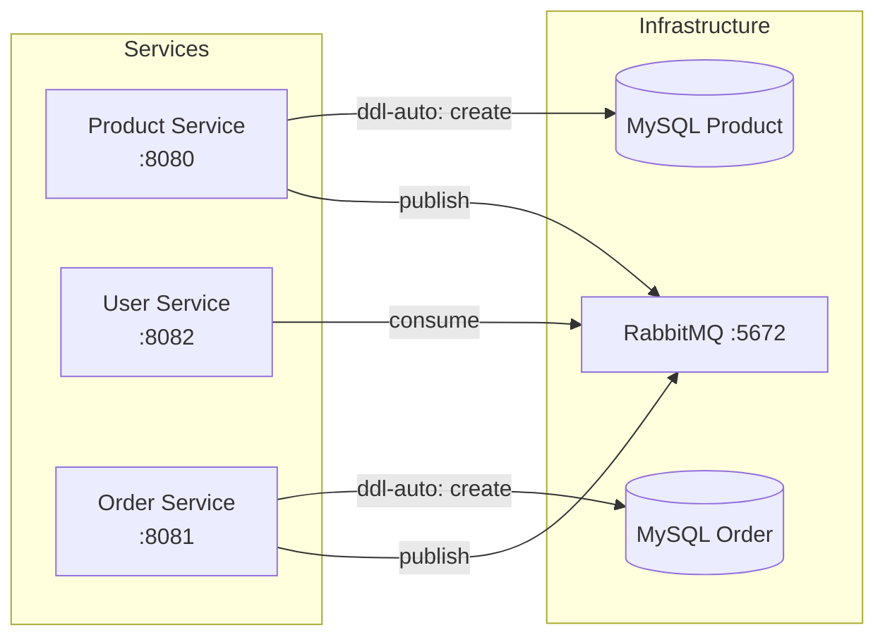
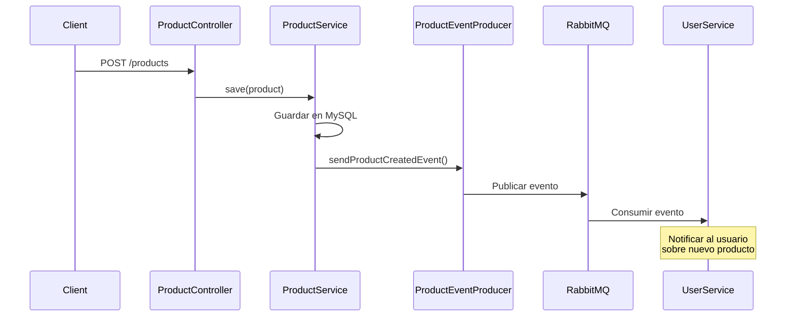

# MICROSERVICIOS IMPLEMENTADOS

## 1. Product Service (Puerto 8080)

Gestiona el catálogo de productos del marketplace.

**Estructura:**
```
product-service/
├── config/RabbitMQConfig.java
├── controller/ProductController.java
├── entity/Product.java
├── event/ProductCreatedEvent.java
├── producer/ProductEventProducer.java
├── repository/ProductRepository.java
├── service/ProductService.java
└── application.yml
```

**Endpoints:**
- `GET /products` - Listar productos
- `GET /products/{id}` - Ver producto
- `POST /products` - Crear producto
- `PUT /products/{id}` - Actualizar
- `DELETE /products/{id}` - Eliminar
- `GET /products/user/{userId}` - Productos por vendedor

**Entidad Product:**
- id, name, description, price, userId, categoryId, status, createdAt

---

## 2. User Service (Puerto 8082)

Gestiona usuarios y autenticación.

**Estructura:**
```
user-service/
├── config/RabbitMQConfig.java
├── consumer/ProductEventConsumer.java
├── controller/UserController.java
├── entity/User.java
├── event/ProductCreatedEvent.java
├── repository/UserRepository.java
├── service/UserService.java
└── application.yml
```

**Endpoints:**
- `GET /users` - Listar usuarios
- `GET /users/{id}` - Ver usuario
- `GET /users/email?email=` - Buscar por email
- `POST /users` - Crear usuario
- `PUT /users/{id}` - Actualizar
- `DELETE /users/{id}` - Eliminar

**Entidad User:**
- id, name, email, phone, status, createdAt

---

## 3. Order Service (Puerto 8081)

Gestiona pedidos y chat entre comprador/vendedor.

**Estructura:**
```
order-service/
├── config/RabbitMQConfig.java
├── controller/OrderController.java
├── entity/
│   ├── Order.java
│   └── OrderMessage.java
├── event/OrderCreatedEvent.java
├── producer/OrderEventProducer.java
├── repository/
│   ├── OrderRepository.java
│   └── OrderMessageRepository.java
├── service/OrderService.java
└── application.yml
```

**Endpoints:**
- `POST /orders` - Crear pedido
- `GET /orders/{id}` - Ver pedido
- `GET /orders/buyer/{buyerId}` - Pedidos del comprador
- `GET /orders/seller/{sellerId}` - Pedidos del vendedor
- `GET /orders/{id}/messages` - Mensajes del pedido
- `POST /orders/{id}/messages` - Enviar mensaje
- `PUT /orders/{id}/status?status=` - Actualizar estado

**Entidades:**
- **Order:** id, productId, sellerId, buyerId, status, createdAt
- **OrderMessage:** id, orderId, authorId, content, timestamp

---

# ORQUESTACIÓN CON DOCKER COMPOSE

## Estructura de Servicios

```yaml
services:
  mysql:           # Product DB (puerto 3307)
  mysql-order:     # Order DB (puerto 3308)
  rabbitmq:        # Message broker (puertos 5672, 15672)
  product-service: # Puerto 8080
  user-service:    # Puerto 8082
  order-service:   # Puerto 8081
```

## Comunicación entre Servicios



## Dependencias

- Cada servicio espera a que MySQL y RabbitMQ estén healthy
- Servicios se comunican por nombres de contenedor (no IPs fijas)
- Volúmenes para persistencia de datos

---

# PERSISTENCIA CON JPA

## Configuración común

```yaml
spring:
  datasource:
    url: jdbc:mysql://mysql:3306/productdb
    username: root
    password: root
  jpa:
    hibernate:
      ddl-auto: create  # auto-genera tablas
    show-sql: true
```

## Beneficios de JPA/Hibernate

| Característica | Descripción |
|----------------|-------------|
| **Abstracción SQL** | No escribir SQL directamente |
| **DDL Auto** | `create` genera tablas automáticamente |
| **Relaciones** | `@ManyToOne`, `@OneToMany` con mapeo automático |
| **Query Methods** | `findByEmail()`, `findByUserId()` sin JPQL |
| **Transaccionalidad** | `@Transactional` para operaciones atómicas |

## Ejemplo de Repository

```java
@Repository
public interface OrderRepository extends JpaRepository<Order, Long> {
    List<Order> findByBuyerId(Long buyerId);
    List<Order> findBySellerId(Long sellerId);
}
```

## Tablas generadas

| Servicio | Tabla | Campos principales |
|----------|-------|-------------------|
| User | users | id, name, email, phone, status, createdAt |
| Product | products | id, name, description, price, userId, status, createdAt |
| Order | orders | id, productId, sellerId, buyerId, status, createdAt |
| Order | order_messages | id, orderId, authorId, content, timestamp |

---

# COMUNICACIÓN ASÍNCRONA CON RABBITMQ

## Concepto

RabbitMQ implementa el patrón **Publisher/Consumer** para comunicación asíncrona entre servicios.

## Componentes

| Componente | Función |
|------------|---------|
| **Exchange** | Recibe mensajes y los enruta |
| **Queue** | Almacena mensajes temporalmente |
| **Binding** | Une Exchange con Queue mediante Routing Key |
| **Message Converter** | Serializa objetos Java a JSON |

## Configuración implementada

```java
@Configuration
public class RabbitMQConfig {
    public static final String QUEUE = "product.created.queue";
    public static final String EXCHANGE = "product.exchange";
    public static final String ROUTING_KEY = "product.created";
    
    @Bean Queue queue() 
    @Bean TopicExchange exchange()
    @Bean Binding binding()
    @Bean RabbitTemplate rabbitTemplate()
}
```

## Flujo de eventos



## Eventos implementados

| Evento | Campos | Uso |
|--------|--------|-----|
| ProductCreatedEvent | productId, userId, name, price | Notificar creación de producto |
| OrderCreatedEvent | orderId, productId, sellerId, buyerId | Notificar creación de pedido |

---

# FRONTEND

El frontend es una aplicación Spring con Thymeleaf que consumirá los endpoints de los microservicios.

## Arquitectura

```
┌─────────────────────────────────────────────┐
│           Frontend (Thymeleaf)               │
│              Puerto 3000                     │
└─────────────────────┬───────────────────────┘
                      │ HTTP
                      ▼
┌─────────────────────────────────────────────┐
│              API Gateway                     │
│               Puerto 8080                    │
└─────────────────────┬───────────────────────┘
                      │
     ┌────────────────┼────────────────┐
     ▼                ▼                ▼
┌─────────┐      ┌──────────┐      ┌─────────┐
│  User   │      │ Product  │      │  Order  │
│Service  │      │ Service  │      │ Service │
│ 8082    │      │  8080    │      │  8081   │
└─────────┘      └──────────┘      └─────────┘
```

## Tecnologías

- Spring Boot + Thymeleaf
- HTML5 + CSS3 + JavaScript
- Client-side routing con thymeleaf

---

# CONCLUSIONES

1. **Desacoplamiento**: Cada microservicio opera de forma independiente, minimizando puntos de fallo.

2. **Escalabilidad**: Docker Compose permite replicar servicios fácilmente.

3. **Persistencia**: JPA/Hibernate simplifica el acceso a datos con MySQL.

4. **Comunicación asíncrona**: RabbitMQ permite que los servicios interactúen sin dependencias directas.

5. **Organización**: La arquitectura basada en capas (Controller → Service → Repository) facilita el mantenimiento.