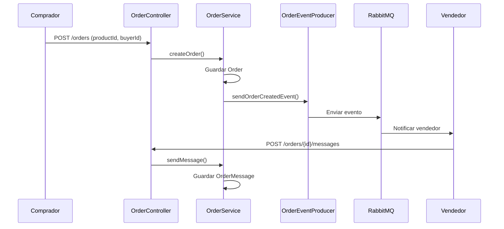

# Order Service - Plan de Implementación

## 📋 Resumen
Microservicio para gestionar pedidos y chat de negociación en marketplace OLX.

## 🗂️ Estructura de Carpetas
```
order-service/
├── src/main/java/pe/order/service/
│   ├── config/
│   │   └── RabbitMQConfig.java
│   ├── controller/
│   │   └── OrderController.java
│   ├── entity/
│   │   ├── Order.java
│   │   └── OrderMessage.java
│   ├── event/
│   │   └── OrderCreatedEvent.java
│   ├── producer/
│   │   └── OrderEventProducer.java
│   ├── repository/
│   │   ├── OrderRepository.java
│   │   └── OrderMessageRepository.java
│   ├── service/
│   │   └── OrderService.java
│   └── OrderServiceApplication.java
└── src/main/resources/
    └── application.yml
```

## 📦 Entidades

### Order.java
```java
@Entity
@Table(name = "orders")
public class Order {
    @Id
    @GeneratedValue(strategy = GenerationType.IDENTITY)
    private Long id;

    private Long productId;      // ID del producto
    private Long sellerId;       // ID del vendedor
    private Long buyerId;        // ID del comprador
    private String status;       // PENDING, COMPLETED, CANCELLED
    private LocalDateTime createdAt;
}
```

### OrderMessage.java
```java
@Entity
@Table(name = "order_messages")
public class OrderMessage {
    @Id
    @GeneratedValue(strategy = GenerationType.IDENTITY)
    private Long id;

    private Long orderId;        // ID del pedido
    private Long authorId;       // ID del autor (buyer o seller)
    private String content;      // Mensaje
    private LocalDateTime timestamp;
}
```

## 📡 RabbitMQ

### Configuración (RabbitMQConfig.java)
```java
public static final String QUEUE = "order.created.queue";
public static final String EXCHANGE = "order.exchange";
public static final String ROUTING_KEY = "order.created";
```

### Event (OrderCreatedEvent.java)
```java
public class OrderCreatedEvent {
    private Long orderId;
    private Long productId;
    private Long sellerId;
    private Long buyerId;
}
```

## 🎯 Controladores

### OrderController.java
```java
@RestController
@RequestMapping("/orders")
public class OrderController {
    // POST /orders - Crear pedido
    // GET /orders/{id} - Ver pedido
    // GET /orders/buyer/{buyerId} - Pedidos del comprador
    // GET /orders/seller/{sellerId} - Pedidos del vendedor
    // GET /orders/{id}/messages - Mensajes del pedido
    // POST /orders/{id}/messages - Enviar mensaje
}
```

## 🔄 Flujo de Datos



## 📝 Instrucciones de Implementación

### Paso 1: Configuración
1. Crear `RabbitMQConfig.java` con exchange, queue y binding
2. Crear `application.yml` con conexión a MySQL y RabbitMQ

### Paso 2: Entidades
1. Crear `Order.java` con campos: id, productId, sellerId, buyerId, status, createdAt
2. Crear `OrderMessage.java` con campos: id, orderId, authorId, content, timestamp
3. Crear repositorios: `OrderRepository`, `OrderMessageRepository`

### Paso 3: Eventos
1. Crear `OrderCreatedEvent.java` con datos del pedido
2. Crear `OrderEventProducer.java` para enviar eventos

### Paso 4: Service
1. Crear `OrderService.java` con métodos:
   - `createOrder()` - Crea pedido y envía evento
   - `getOrdersByBuyer()` - Lista pedidos del comprador
   - `getOrdersBySeller()` - Lista pedidos del vendedor
   - `getMessagesByOrder()` - Lista mensajes de un pedido
   - `sendMessage()` - Envía mensaje al chat

### Paso 5: Controller
1. Crear `OrderController.java` con endpoints REST

### Paso 6: Docker
1. Agregar `order-service` a `docker-compose.yml`
2. Configurar dependencias: mysql y rabbitmq